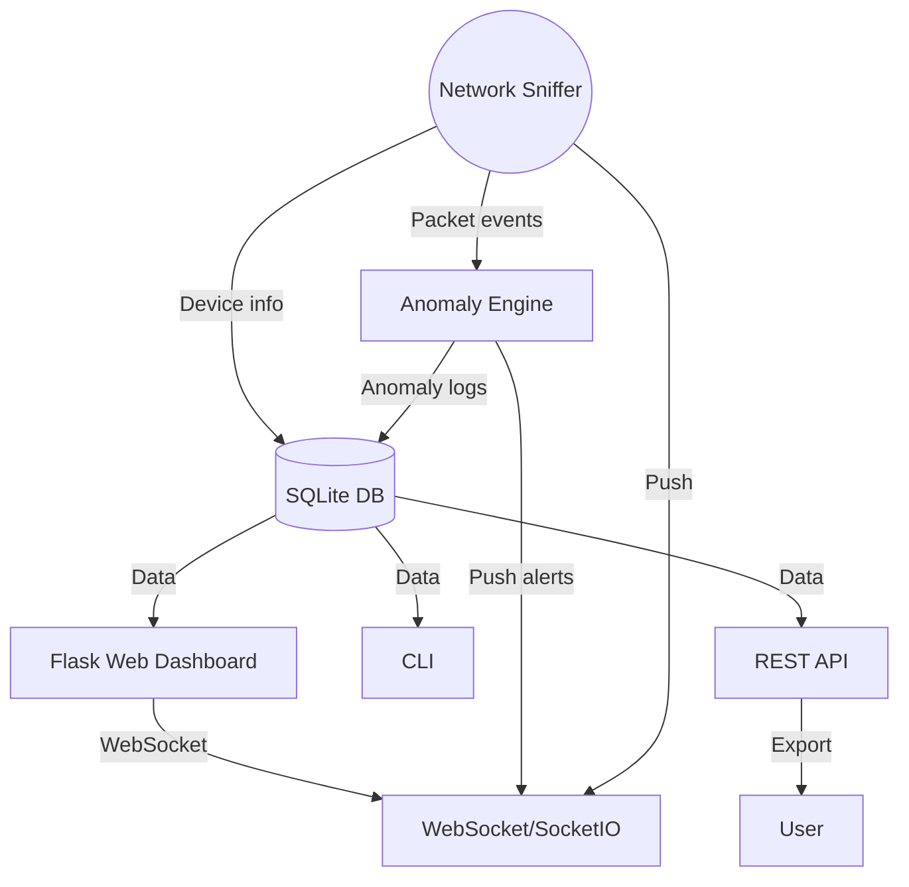

# Passive Network Scanner & Anomaly Detector

A production-ready Python 3.x project for real-time, passive network monitoring and anomaly detection with a modern Flask web dashboard and CLI utilities.

---

## 🍃 Overview

This tool *sniffs local network traffic*, fingerprints devices, and proactively raises alerts for suspicious activities like ARP spoofing, rogue DHCP servers, duplicate IPs, MAC cloning, and unusual traffic bursts.

- **Packet capture:** Scapy-based, covers ARP/DHCP/mDNS/TCP
- **Device profiler:** Tracks all hosts, OS guess, vendor, first/last seen
- **Anomaly detection:** Auto-detects spoofing, clones, traffic spikes, etc.
- **Persistent log:** Writes and reads events using SQLite
- **REST APIs:** Query state in JSON/CSV
- **Web dashboard:** Dark mode, real-time updates, charts, and mobile-friendly
- **Network security score:** Gauges overall security health in one glance
- **CLI tools:** For automation and scripting

---

## 🏗️ Architecture



---

## ⚙️ How it works

- **Scapy** sniffs packets (ARP, DHCP, TCP SYN, mDNS)
- **Device model** updates as new hosts are seen (MAC OUI lookup, TTL/OS guess)
- **Rules engine** checks live for ARP spoofing, DHCP rogue servers, IP/MAC conflicts, traffic bursts, etc.
- **SQLite** keeps all historical device/anomaly/event data
- **Flask app** serves a real-time dashboard, REST API, and websocket updates
- **SocketIO** pushes device/anomaly/live updates to all web clients instantly
- **CLI** provides headless invocation and export options

---

## 🚀 Installation

```bash
# Linux, macOS, Windows (Python 3.8+ required, must be run as root/admin)
git clone https://github.com/Kagias/passive-network-scanner.git
cd passive-network-scanner
python3 -m venv venv
. venv/bin/activate
pip install -r requirements.txt
```

---

## 🛠️ Usage

### 1. Config

Edit `config.yaml` to your needs. Example:

```yaml
interface: eth0
traffic_burst_threshold: 100
oui_lookup_url: "https://macvendors.co/api/"
web:
  host: "0.0.0.0"
  port: 5000
  debug: true
```

---

### 2. Run the dashboard

```bash
sudo python run.py web
```

Access: http://localhost:5000

---

### 3. Use the CLI

```bash
sudo python run.py scan
sudo python run.py show devices
sudo python run.py show alerts
sudo python run.py export --format json
```

---

### 4. REST/Export

- Devices: `/api/devices`
- Anomalies: `/api/anomalies`
- Export JSON: `/api/export?format=json`
- Export CSV: `/api/export?format=csv`

---

## 📺 Demo

```
+-----------------------------------------------------------+
|  Passive Network Scanner Terminal CLI                     |
+-----------------------------------------------------------+
| [*] Starting passive monitoring on eth0...                |
| [+] Device discovered: 192.168.1.12  a0:99:9b:fd:5a:11    |
| [!] ARP Spoofing Detected: 192.168.1.1 mapped to 2 MACs   |
| [!] Rogue DHCP OFFER from 192.168.1.201                   |
| [+] Exported scan results -> devices.json                 |
+-----------------------------------------------------------+

# Web Dashboard: (ASCII)
  +-----------------------------------------------------+
  | Devices | Alerts | Network Graph | Security Score   |
  +-----------------------------------------------------+
  | ... real-time updating ...                          |
  +-----------------------------------------------------+
```

---


## 🛡️ Security Considerations

- **Passive only:** No active probes; can't disrupt network
- **Root required:** Packet sniffing needs root/admin
- **Private SQLite:** All data stored locally
- **Web access:** Restrict Flask app to LAN or VPN only

---

## 🛣️ Roadmap
Planned features (high-level)

- [ ] Alert email/SMS integration
- [ ] Docker deployment
- [ ] Plugin system for custom rules/output
- [ ] Better IoT device fingerprinting
- [ ] Visualization: network topology map
- [ ] Integration with external SIEM/log platforms

---

## 👨‍💻 Author

- GitHub: Kagias
- License: MIT

---
